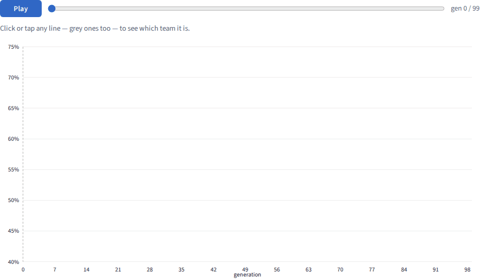
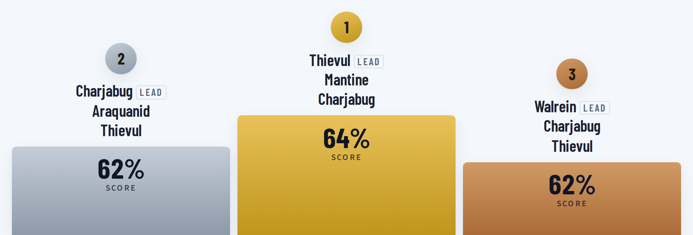

# PoGo GBL Team Generator 🏆

Node.js tool that finds the strongest GO Battle League teams buildable from
your own Pokemon collection. Candidate teams are ranked by simulating full
3v3 battles — switching, shields, and AI decisions — against the current
meta, using [pvpoke](https://pvpoke.com)'s own battle engine (vendored and
executed headlessly, never reimplemented).

Below is a run over my 107-mon collection: 100 generations of evolutionary
search, 443,923 battles simulated. Each line is one team's win rate per
generation; the colored lines are the final top 10.

<p align="center">
  
</p>

The three teams that came out on top:

<p align="center">
  <picture>
    <source media="(prefers-color-scheme: dark)" srcset="docs/podium-dark.png">
    
  </picture>
</p>

## Quickstart 🚀

1. Take a screen recording of yourself swiping through all your Pokemon with
   the "appraise" panel open.
2. Convert the video into a CSV with
   [Pokemon GO Video-to-CSV](https://github.com/Gidntsquia/pokemon-go-video-to-csv)
   (macOS only). A [Poke Genie](https://pokegenie.app) export also works
   (Settings → Export → CSV).
3. Run this (requires Node ≥ 18):

```
git clone https://github.com/Gidntsquia/pogo-gbl-team-generator
cd pogo-gbl-team-generator
npm run setup                        # Downloads pvpoke's engine + data (required after every fresh clone)
node src/cli.js your-collection.csv
```

The top teams are printed to the terminal, and the full report is written to
`out/report.md` + `out/report.html`. A sample collection is included for
trying it out:

```
node src/cli.js fixtures/sample-pokegenie.csv
```

Other common invocations:

```
node src/cli.js my.csv --cp 2500 --threads 4          # Ultra League, battles on 4 threads
node scripts/evolve.mjs my.csv --deadline-minutes 30  # genetic algorithm team search
node src/cli.js --help                                # full flag list
```

## Features 🔬

- Teams are ranked by simulated battle results rather than stat comparisons:
  every candidate team fights full 3v3 battles against curated ladder teams
  and sampled meta compositions, across all 9 lead matchups.
- `scripts/evolve.mjs` runs a genetic algorithm in which the candidate teams
  and the opponent pool evolve against each other, which prevents
  overfitting to a fixed opponent list. Interrupted runs resume from their
  checkpoints.
- Each mon is also evaluated as every evolution it can still become,
  carrying its own IVs and flags, so an unevolved specimen is judged at its
  potential.
- Every ranked team includes its build cost — the Stardust, Candy, and
  Candy XL required to reach the simulated build — with shadow/purified/
  lucky modifiers and evolution items accounted for.
- Great League and Ultra League are supported end-to-end (`--cp 2500`),
  along with cup bans (`--ban`).
- Runs are deterministic: the same seed produces identical results, whether
  serial or parallelized with `--threads N`.

## Documentation 📚

Detailed documentation is in the
[wiki](https://github.com/Gidntsquia/pogo-gbl-team-generator/wiki):

- [Running the CLI](https://github.com/Gidntsquia/pogo-gbl-team-generator/wiki/Running-the-CLI) — every flag, leagues, Best Buddies, current moves, tuning, threads
- [How Scoring Works](https://github.com/Gidntsquia/pogo-gbl-team-generator/wiki/How-Scoring-Works) — 1v1 pruning, 3v3 ranking, sampling weights, role priors
- [Build Costs and Evolutions](https://github.com/Gidntsquia/pogo-gbl-team-generator/wiki/Build-Costs-and-Evolutions) — the Stardust/Candy math
- [Evolutionary Team Search](https://github.com/Gidntsquia/pogo-gbl-team-generator/wiki/Evolutionary-Team-Search) — the genetic algorithm, fitness modes, checkpoints
- [Shared Collections](https://github.com/Gidntsquia/pogo-gbl-team-generator/wiki/Shared-Collections) — teams two players can both build
- [Development and Tests](https://github.com/Gidntsquia/pogo-gbl-team-generator/wiki/Development-and-Tests) — test tiers, what to run when
